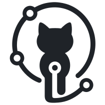

<p align="center">
  <a href="https://github.com/swadhinbiswas/OpencodeHub">
    
  </a>
</p>

<h1 align="center">OpenCodeHub</h1>

<p align="center">
  <strong>The self-hosted Git collaboration platform that doesn't compromise.</strong><br>
  Stacked PRs · Speculative Merge Queue · GitHub Actions CI/CD · AI Code Review · Enterprise Security · High-Performance CLI
</p>

<p align="center">
  <a href="https://github.com/swadhinbiswas/OpencodeHub/actions"></a>
  <a href="LICENSE"></a>
  <a href="https://www.npmjs.com/package/opencodehub-cli"></a>
  <a href="https://hub.docker.com/r/opencodehub/opencodehub"></a>
  <a href="https://docs.opencodehub.space"></a>
</p>

---

OpenCodeHub is an open-source, self-hosted alternative to GitHub and GitLab engineered as a modular monolith. It provides stack-first developer workflows (Graphite-style stacked diffs), an automated merge queue with speculative builds, Docker-based CI/CD pipelines, and multi-model AI code reviews out of the box — with zero per-seat licensing fees.

**[Documentation](https://docs.opencodehub.space)** · **[CLI Quickstart](#-opencodehub-cli-och)** · **[Deploy in 5 Minutes](#-quickstart--deployment)** · **[API Reference](https://docs.opencodehub.space/api/rest-api/)**

---

## ✨ Key Differentiators

| Capability | What It Does | Why It Matters |
|---|---|---|
| **Stacked PRs** | Break complex features into small, dependent branches and PRs (`och stack`) | Faster reviews, zero merge blocking, unblocked teammates |
| **Merge Queue** | Parallel CI validation with speculative builds and priority lanes | Protects `main` from broken builds without serialized slow merges |
| **CI/CD Pipelines** | GitHub Actions YAML compatibility with isolated Docker executors | Native pipeline execution without external CI SaaS dependencies |
| **Multi-Provider AI Review** | Automated code reviews powered by GPT-4, Claude 3.5, Gemini 1.5, Groq, Ollama | Instant feedback on PRs before human peer review |
| **Pluggable Storage** | Local filesystem or S3-compatible object storage (AWS, MinIO, R2, B2, Ceph) | Flexible deployment across homelabs, NAS servers, or hyper-scale clouds |
| **Federation** | Fork, push branches, and submit cross-instance pull requests across servers | Seamless collaboration across autonomous OpenCodeHub instances |

---

## 💻 OpenCodeHub CLI (`och`)

The official OpenCodeHub CLI (`opencodehub-cli`) delivers a terminal-first workflow for stacks, code reviews, merge queues, and repository management.

### Installation

Install globally using your preferred package manager:

```bash
# via npm
npm install -g opencodehub-cli

# via bun
bun add -g opencodehub-cli

# via pnpm
pnpm add -g opencodehub-cli

# via yarn
yarn global add opencodehub-cli
```

Or run directly without installing:

```bash
npx opencodehub-cli --help
```

### 1. Authenticate

```bash
# Interactive login
och auth login --url https://git.yourcompany.com

# Non-interactive / CI login with Personal Access Token
och auth login --url https://git.yourcompany.com --token och_xxxxxxxxxxxx

# Check health & auth status
och config doctor
```

### 2. Stacked PR Workflow

Create and submit Graphite-style stacked branches in seconds:

```bash
# Create first stacked branch
och stack create feature/user-auth

# Commit changes, then create dependent branch
git commit -am "feat: implement auth middleware"
och stack create feature/user-profile

# Push all branches in the stack and generate linked PRs automatically
och stack submit

# Visualize your stack topology in terminal
och stack log

# Rebase the whole stack when upstream main updates
och stack sync
```

### 3. Interactive Focus Cockpit (`och focus`)

Launch the terminal dashboard for PRs, reviews, and merge queue operations:

```bash
och focus
```

- **Interactive Timeline**: Switch branches, view diff stats, and trigger CI runs without leaving the CLI.
- **Review Cockpit**: Approve, request changes, or trigger AI code reviews inline.
- **Queue Controls**: Enqueue PRs and monitor speculative build states in realtime.

### 4. Merge Queue Management

```bash
# View active queue status and speculative lanes
och queue list

# Enqueue a PR for automated CI validation and merge
och queue add 42

# Check queue position and build attempts
och queue status 42
```

---

## 🚀 Quickstart & Deployment

### Production Stack (Docker Compose)

```bash
# 1. Clone the repository
git clone https://github.com/swadhinbiswas/OpencodeHub.git
cd OpenCodeHub

# 2. Configure environment
cp .env.example .env
# Edit .env and set your secrets (JWT_SECRET, SESSION_SECRET, POSTGRES_PASSWORD, REDIS_PASSWORD)

# 3. Launch the container stack
docker compose up -d

# 4. Initialize the admin account
docker compose exec app bun scripts/seed-admin.ts
```

Open **`http://localhost:4321`** in your browser to start collaborating.

### Container Images

Official minimal production images (251 MB) are published on Docker Hub:

| Service | Image Tag | Purpose |
|---|---|---|
| **Platform** | `opencodehub/opencodehub:latest` | Web UI + REST & GraphQL API + Git HTTP / SSH Server |
| **Worker** | `opencodehub/opencodehub-worker:latest` | Background queues, webhooks, and automation jobs |
| **Runner** | `opencodehub/opencodehub-runner:latest` | Docker-in-Docker CI/CD pipeline execution runner |

---

## 🎨 Design System & Theme

OpenCodeHub features a modern developer UI built on **Tailwind CSS**, **Radix UI**, and clean GitHub/Linear design principles:

- **Adaptive Theming**: Native dark and light theme support with zero layout flicker.
- **High-Contrast Dark Mode**: Pure zinc/slate dark surfaces (`#0d1117` / `#161b22`) paired with crisp emerald status indicators (`#238636`).
- **Responsive Workspace**: Full mobile, tablet, and desktop fidelity with integrated keyboard shortcuts.

---

## 🏛 Architecture

```
┌─────────────────────────────────────────────────────────────┐
│                        CLIENTS                               │
│  Browser  │  Git CLI (HTTP/SSH)  │  OpenCodeHub CLI (och)   │
└─────────────────────────────────────────────────────────────┘
                              │
┌─────────────────────────────────────────────────────────────┐
│                    OPENCODEHUB PLATFORM                      │
│  ┌─────────────┐  ┌─────────────┐  ┌─────────────────────┐  │
│  │  Web UI     │  │  REST API   │  │  GraphQL Endpoint   │  │
│  │ (Astro+React│  │ (175+ routes│  │ (src/pages/api/...) │  │
│  └─────────────┘  └─────────────┘  └─────────────────────┘  │
│  ┌─────────────┐  ┌─────────────┐  ┌─────────────────────┐  │
│  │ Git Server  │  │ SSH Server  │  │  Pipeline Runner    │  │
│  │ (HTTP RPC)  │  │ (ssh2 daemon│  │ (Docker Executor)   │  │
│  └─────────────┘  └─────────────┘  └─────────────────────┘  │
└─────────────────────────────────────────────────────────────┘
                              │
┌─────────────────────────────────────────────────────────────┐
│              PERSISTENCE & INFRASTRUCTURE                    │
│  PostgreSQL / SQLite / Turso │ Redis (Queues) │ Pluggable S3 │
└─────────────────────────────────────────────────────────────┘
```

---

## 🧪 Development & Testing

```bash
# Install dependencies
npm install

# Push database schema
npm run db:push

# Run full test suite (679 unit, integration & contract tests)
npm run test

# Typecheck & verify build
npm run typecheck
npm run build
```

---

## 📄 License

OpenCodeHub is released under the [MIT License](LICENSE).
