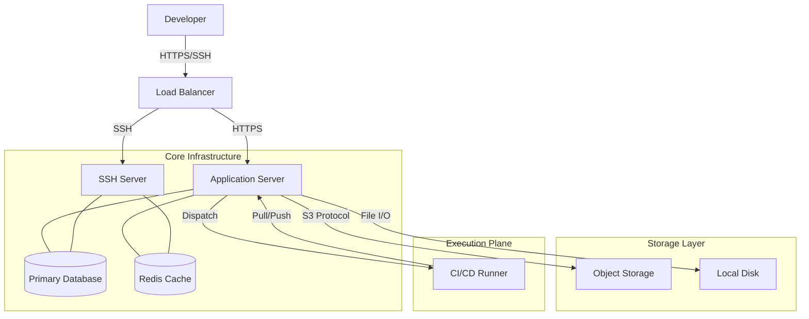
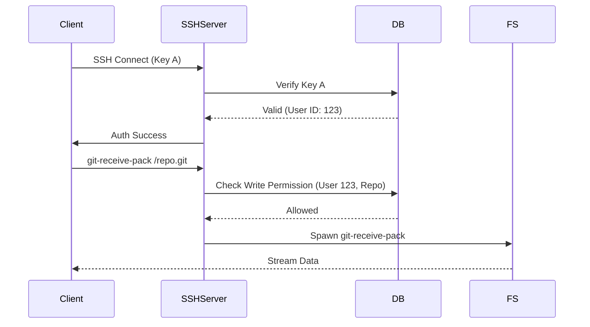
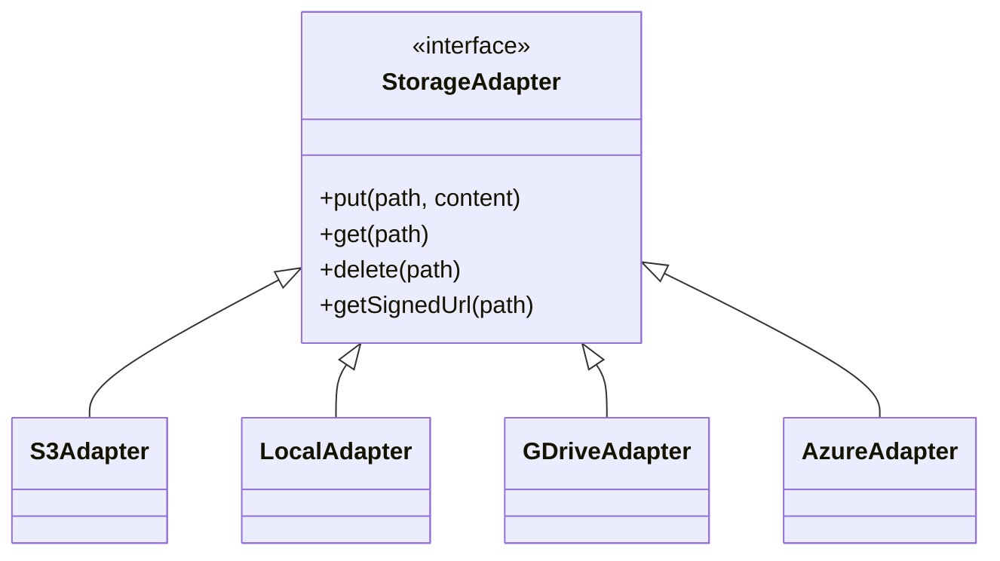

# System Architecture

OpenCodeHub is designed as a modular, monolithic application to ensure simplicity in deployment while maintaining scalability for enterprise use cases.

## High-Level Overview



## Core Components

### 1. Application Server (Next.js / Astro)

The heart of OpenCodeHub. It handles:
- **Web UI**: Rendering the interface using Astro (SSG/SSR) and React (Client components).
- **API**: Providing REST and tRPC endpoints for the CLI and frontend.
- **Git over HTTPS**: Handling `git-upload-pack` and `git-receive-pack` requests.
- **Authentication**: Managing user sessions, JWTs, and SSO (GitHub/GitLab OAuth).

**Key Libraries:**
- `isomorphic-git`: Pure JavaScript implementation of Git.
- `trpc`: End-to-end typesafe APIs.
- `lucia`: Authentication library.

### 2. SSH Server

A dedicated Node.js process that handles Git operations over SSH.

- **Port**: 2222 (default)
- **Authentication**: Public key authentication against the database.
- **Command Handling**: Intercepts `git-upload-pack`, `git-receive-pack`, and `git-upload-archive`.



### 3. Database Layer (Drizzle ORM)

We use **Drizzle ORM** for its lightness and TypeScript support. The schema is designed to be database-agnostic.

**Supported Engines:**
- **PostgreSQL**: Recommended for production.
- **MySQL**: Supported.
- **SQLite / LibSQL**: Supported (great for edge/small deployments).

**Key Tables:**
- `users`: Credentials and profile.
- `repositories`: Metadata and settings.
- `pull_requests`: PR state, description, and review status.
- `commits`: Indexed commits for fast lookup (optional cache).

### 4. Storage Abstraction

OpenCodeHub does not rely on a local filesystem for long-term storage, enabling stateless deployments.



**Common Uses:**
- **LFS Objects**: Large binary files.
- **Avatars**: User-uploaded images.
- **CI Artifacts**: Build outputs.
- **Repository Data**: Raw git objects (using our custom `git-object-store`).

### 5. CI/CD Runner System

The built-in system allows running GitHub Actions-compatible workflows.

**Workflow:**
1. **Trigger**: `push` or `pull_request` event.
2. **Parsing**: Server parses `.github/workflows/*.yml`.
3. **Dispatch**: Job is placed in a Redis queue.
4. **Execution**: A Runner (separate process/container) picks up the job.
5. **Isolation**: Uses `dockerode` to spin up ephemeral containers.
6. **Reporting**: Streams logs back to Redis -> Web UI.

---

## Directory Structure

```text
/
├── src/
│   ├── pages/          # Astro pages (Routes)
│   ├── components/     # React UI components
│   ├── server/         # Backend logic (tRPC routers)
│   ├── lib/            # Shared utilities (Git, Auth, Storage)
│   └── db/             # Database schema and client
├── drizzle/            # Migration files
├── public/             # Static assets
└── scripts/            # Admin scripts (Seeding, Init)
```
